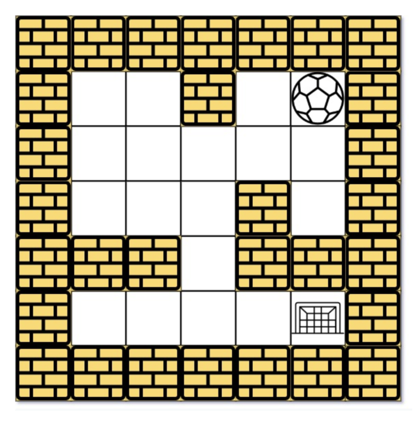
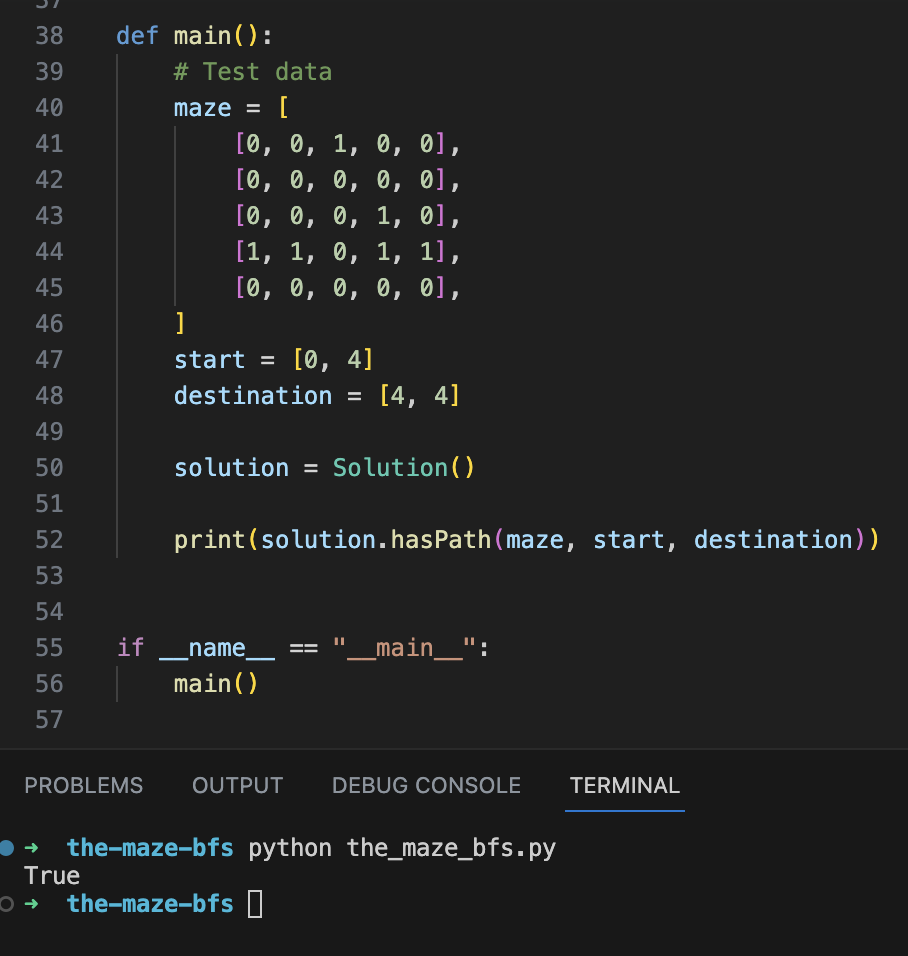

# Description

The maze project belongs to the question number 490 of Leetcode problems. Here, we have a ball in the given maze which has to reach the point of goal post.
We perform this action with the Breadth First Search in this solution. Bread First Search (BFS) is guaranteed to find the shortest and optimal path if exist.




# Design

Breadth-First Search (BFS) traversal explores the maze by visiting neighboring cells level by level, ensuring shorter paths are discovered first.

* Represents the problem where we have to reach the goal post in shortest path as possible.
* The solution we chose is to use Breadth First Search (DFS):
    * At each cell, we go through the cells until we reach the boundary of the maze.
    * This process is repeated until we reach the required target
* In Breadth First Traversal, we initialize a queue to keep the visited cells.
* After each cycle we print the cells.
* BFS is guaranteed to find the shortest path if exist.
* Unlike DFS, it will not get stuck in the maze as well as it finds the optimal solution.


The maze is represented as a matrix where as the starting point and ending point will be represented as below:


## Prepare input data
```
    maze = [
        [0, 0, 1, 0, 0],
        [0, 0, 0, 0, 0],
        [0, 0, 0, 1, 0],
        [1, 1, 0, 1, 1],
        [0, 0, 0, 0, 0],
    ]
    start = [0, 4]
    destination = [4, 4]
```


# Implementation

## Algorithm

### Description

* The hasPath function determines if there's a path between start and destination in a maze.
* It uses a Breadth-First Search (BFS) approach, exploring neighboring cells level by level.
* A queue is used to track positions to visit next, and a set visited prevents revisiting cells.
* The algorithm iterates through potential paths, considering movement in four directions.
* If the destination is reached, the function returns True; otherwise, it returns False.


To see the algorithm in python code, you can view the file named 'the_maze_bfs.py' in the current folder.

## Testing and Executing

### Execute
```
  $ python the_maze_bfs.py
```

### Test Result

Test Case:

For the above maze, the test inputs will be as mentioned above:

```
    maze = [
        [0, 0, 1, 0, 0],
        [0, 0, 0, 0, 0],
        [0, 0, 0, 1, 0],
        [1, 1, 0, 1, 1],
        [0, 0, 0, 0, 0],
    ]
    start = [0, 4]
    destination = [4, 4]
```

This will return True, as there is a valid and shortest path from the ball [0, 4] to the goal post [4, 4].




## Google Slide Presentation

For a detailed design and representation for the above maze problem solved using BFS, you can check this link:
[The Maze Project: Breadth First Traversal (BFS)](https://docs.google.com/presentation/d/1uLGWEco2ZTl8GhAYpG50nPyGG91err7N48WqVAh9w9I/edit#slide=id.g239b0e87cad_0_574)