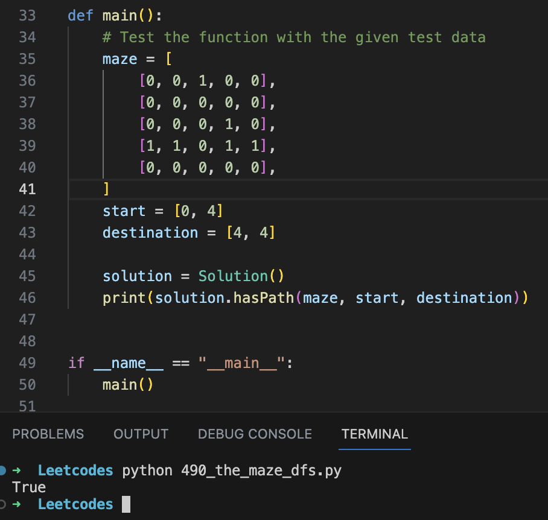

# Description

The maze project belongs to the question number 490 of Leetcode problems. Here, we have a ball in the given maze which has to reach the point of goal post.
We perform this action with the Depth First Search in this solution.


# Design

The ball can only move one cell at a time. In DFS, the ball can move through the sequence as: Right -> Left -> Up -> Down. The position of ball is represented as 0 and the post as 1.

* Represents the problem where we have to reach the goal post without going out of bounds.
* The solution we chose is to use Depth First Search (DFS):
    * At each cell, it checks if the destination is reached. 
    * If not, it explores neighboring cells in all four directions, ensuring the ball rolls until hitting a wall or going out of bounds. 
    * The visited cells are tracked to avoid infinite loops.
* The current solution is a valid approach to solving the problem. However, for large mazes, it might encounter a maximum recursion depth error due to the recursive DFS. To address this, you can implement an iterative DFS using a stack to avoid recursion.
* Additionally, you could use memoization to store the results of previously explored paths to avoid redundant calculations and improve efficiency.

The maze is represented as a matrix where as the starting point and ending point will be represented as below:


## Prepare input data
```
    maze = [
        [0, 0, 1, 0, 0],
        [0, 0, 0, 0, 0],
        [0, 0, 0, 1, 0],
        [1, 1, 0, 1, 1],
        [0, 0, 0, 0, 0],
    ]
    start = [0, 4]
    destination = [4, 4]
```


# Implementation

## Algorithm

### Description

* Define the function signature with type hints to ensure code readability and correctness.
* The DFS function (dfs) explores possible paths from the current position (x, y) in the maze and returns True if the destination is reached, otherwise checks the base case and returns True if the current position is equal to the destination.
* Mark the current cell (x, y) as visited using a set called "visited" and explore neighboring cells in up, down, left, and right directions until hitting a wall or going out of bounds.
* Explore neighboring cells using a loop to move the ball in each direction until it hits a wall or goes out of bounds (updating position to new coordinates); then recursively explore unvisited cells.
* Perform the DFS from the start position (start[0], start[1]) to initiate the search.
* Return the result of the DFS function as the final output

To see the algorithm in python code, you can view the file named 'the_maze_dfs.py' in the current folder.

## Testing and Executing

### Execute
```
  $ python the_maze_dfs.py
```

### Test Result

Test Case:

For the above maze, the test inputs will be as mentioned above:

```
    maze = [
        [0, 0, 1, 0, 0],
        [0, 0, 0, 0, 0],
        [0, 0, 0, 1, 0],
        [1, 1, 0, 1, 1],
        [0, 0, 0, 0, 0],
    ]
    start = [0, 4]
    destination = [4, 4]
```

This will return True, as there is a valid path from the ball [0, 4] to the goal post [4, 4].




## Google Slide Presentation

For a detailed design and representation for the above maze problem solved using DFS, you can check this link:
[The Maze Project: Depth First Traversal (DFS)](https://docs.google.com/presentation/d/1PqAHiwWydEi6VVqDKE7wjgHI2zOeo7lVcULN06PD26o/edit#slide=id.g239b0e87cad_0_248)